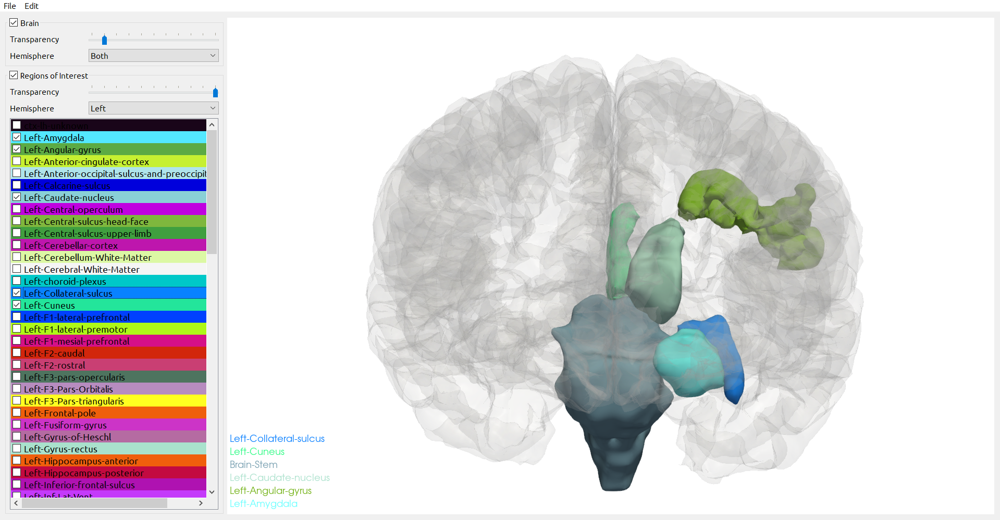

# 🧠 BrainViewer

  

> *A Python-based 3D Viewer for Visualizing ROIs from FreeSurfer reconstruction*

## 👁️‍🗨️ Overview

A Python-based 3D Viewer

## 🖥️ Installation

```bash
git clone https://github.com/BarryLiu97/BrainViewer.git
conda create -n viewer python
conda activate viewer 
cd BrainViewer
pip install -r requirements.txt
```

## 🗝️ Usage

```bash
cd BrainViewer
python main.py
```
